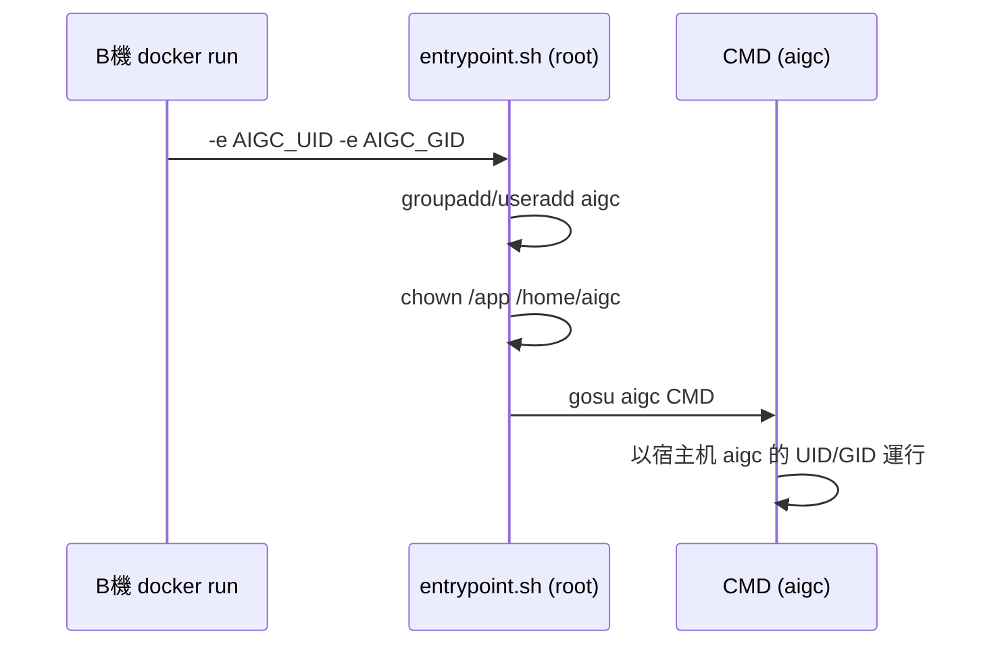

# Runtime 對齊 aigc UID/GID 設計說明

本文件說明「在 B 機用 runtime 對齊」的設計：image 內不寫死 aigc 使用者，改由 entrypoint 依環境變數在容器啟動時建立對應 UID/GID 的 aigc，並用 gosu 切換後執行 CMD，使容器程序與宿主机 aigc 身份一致。

---

## 目標

- 同一份 image 可在不同宿主机（B 機）上運行，容器內程序使用的 UID/GID 與該宿主机上的 `aigc` 一致。
- 透過 B 機執行 `docker run -e AIGC_UID=$(id -u aigc) -e AIGC_GID=$(id -g aigc) ...` 傳入，無需在 build 時寫死或傳 ARG。

---

## 架構概覽



- **Build 時**：image 內不建立 aigc，不對 `/app` 做 chown，Python 套件改為「以 root 安裝到系統/共用路徑」。
- **Run 時**：entrypoint 以 root 啟動，讀取 `AIGC_UID`/`AIGC_GID`，建立 aigc 並 chown，再 `gosu aigc` 執行 CMD。

---

## 1. Dockerfile 變更

| 項目     | 現狀                                                | 變更 |
|----------|-----------------------------------------------------|------|
| 使用者建立 | `RUN groupadd -g 1001 aigc && useradd ...`         | **刪除**，改由 entrypoint 建立 |
| /app 權限 | `RUN chown -R aigc:aigc /app`                       | **刪除**，改由 entrypoint 做 chown |
| USER     | `USER aigc`                                         | **刪除**，預設以 root 啟動以執行 entrypoint |
| pip 安裝 | 在 `USER aigc` 之後執行，套件裝到 `/home/aigc/.local` | **改為 root 執行**，安裝到系統路徑，避免依賴 /home/aigc |
| PATH     | `ENV PATH="/home/aigc/.local/bin:..."`              | 改為僅保留 `/opt/ffmpeg/bin` 等，不再依賴 `/home/aigc/.local/bin` |
| 新增     | -                                                   | 安裝 **gosu**（`apt-get install -y gosu`） |
| 新增     | -                                                   | 複製 **entrypoint 腳本** 並設為 `ENTRYPOINT` |
| CMD      | 不變                                                | 維持 `CMD ["tail", "-f", "/dev/null"]` |

建議順序（邏輯上）：

1. 安裝 runtime 依賴後，加上 `gosu`。
2. `COPY build_assets/ /app/` 後**不要** chown，也不再建立 aigc。
3. 以 **root** 執行 pip 安裝，確保套件在系統路徑。
4. 設定 `PATH`、`LD_LIBRARY_PATH`（去掉 `/home/aigc/.local/bin`）。
5. `COPY build_assets/entrypoint.sh /entrypoint.sh` 並 `RUN chmod +x /entrypoint.sh`。
6. `ENTRYPOINT ["/entrypoint.sh"]`，`CMD` 維持不變。

---

## 2. Entrypoint 腳本（build_assets/entrypoint.sh）

- **位置**：放在 `build_assets` 以便 `COPY` 進 image，容器內為 `/entrypoint.sh`。
- **行為**：
  1. 讀取環境變數：`AIGC_UID=${AIGC_UID:-1001}`、`AIGC_GID=${AIGC_GID:-1001}`（未傳則 1001）。
  2. 建立群組與使用者（若尚不存在）：
     - `groupadd -g "$AIGC_GID" aigc`（若 GID 已存在可加 `|| true` 或先檢查）。
     - `useradd -m -s /bin/bash -u "$AIGC_UID" -g "$AIGC_GID" aigc`（若 UID 已存在則略過或 `|| true`）。
  3. 權限設定：`chown -R aigc:aigc /app`，以及 `chown -R aigc:aigc /home/aigc`（讓 aigc 有可寫的 home，供後續 pip --user 或 cache 使用）。
  4. 執行：`exec gosu aigc "$@"`，將 CMD 以 aigc 身份執行。
- **腳本要點**：
  - Shebang：`#!/usr/bin/env bash` 或 `#!/bin/bash`，可選 `set -e`。
  - 若 `useradd`/`groupadd` 因 UID/GID 已存在而失敗，可用 `|| true` 或先以 `getent` 檢查，避免啟動失敗；必要時可細化為「若建立失敗則僅 chown /app 給該 UID:GID，並用數字 UID 跑」。
  - 僅在 entrypoint 內建立一次 aigc；同一容器重啟時已有該使用者則跳過。

---

## 3. B 機（宿主机）使用方式

**傳入 UID/GID**（與宿主机 aigc 對齊）：

```bash
docker run -e AIGC_UID=$(id -u aigc) -e AIGC_GID=$(id -g aigc) -it aiflowbase:0.3
```

- 若未傳 `AIGC_UID`/`AIGC_GID`，entrypoint 使用預設 1001，行為與先前寫死 1001 相容。
- 可選：在 B 機寫小腳本或 compose 片段，統一帶入 `AIGC_UID`/`AIGC_GID`，方便團隊使用。

---

## 4. 權限與目錄設計

- **/app**：由 entrypoint 以 `chown -R aigc:aigc /app` 交給 aigc，改為在「啟動時」做，以配合當時的 AIGC_UID/AIGC_GID。
- **/home/aigc**：由 entrypoint 建立（`useradd -m`）並 chown 給 aigc，供 shell 登入、pip --user、cache 等使用。
- **Python 套件**：build 時以 root 裝到系統路徑，不依賴 `/home/aigc/.local`；若未來以 aigc 在容器內再裝套件，會寫入 `/home/aigc/.local`，由上述 chown 保證權限正確。

---

## 5. 邊界情況與取捨

- **宿主机 aigc 的 UID/GID 與 image 內既有帳號衝突**（例如宿主机 aigc 為 1000，base image 已有 uid 1000）：
  - `groupadd`/`useradd` 可能失敗；可在腳本中對這類錯誤做 `|| true`，或改為「若建立失敗則僅 chown /app 給該 UID:GID，並用 `exec runuser -u #${AIGC_UID} -- "$@"` 以數字 UID 跑」。若多數環境 aigc 為 1001 且不與系統帳號衝突，可先實作「建立 aigc + gosu」，再視需要補 fallback。
- **只讀 rootfs**：若容器以只讀 rootfs 運行，`useradd` 會寫入 /etc/passwd、/etc/group，需確保 /etc 可寫或改用其他方式（例如只做 `--user` 不建立使用者）；目前方案假設 /etc 可寫。
- **Kubernetes/編排**：若在 K8s 運行，可在 deployment 的 env 中設定 `AIGC_UID`/`AIGC_GID`（例如從 host 或 ConfigMap 注入），或使用 securityContext runAsUser/runAsGroup；若使用 runAsUser，則可能不再需要 entrypoint 建立使用者，但若仍需「容器內名稱為 aigc 且 /app 為其擁有」，則保留 entrypoint 並傳入 env 即可。

---

## 6. 檔案清單與依賴

- **需修改**：`Dockerfile`（移除固定 useradd/chown/USER aigc，改 pip 與 PATH，加入 gosu、entrypoint）。
- **需新增**：`build_assets/entrypoint.sh`（建立 aigc、chown、exec gosu）。
- **可選**：在 Readme.md 或 build-aiflowbase-image.sh 註解中說明 B 機應傳入 `AIGC_UID`/`AIGC_GID` 的用法。
- **依賴**：image 內需有 `gosu`（Debian/Ubuntu 來自 apt），無需額外二進制。

---

## 7. 與「Build ARG 方案」的差異

| 方案           | 說明 |
|----------------|------|
| **Build ARG**  | 在**建構 image 的那台機器**上取得 UID/GID，image 內 aigc 固定為該組數字；換到另一台 build 或 run 時，若 UID/GID 不同需重新 build 或接受不一致。 |
| **Runtime 對齊** | image 內不綁死 UID/GID，**每次在 B 機 run 時**傳入該機的 aigc UID/GID，同一 image 可在多台 B 機使用並各自對齊該機 aigc；代價是啟動時多一次 entrypoint（建立使用者 + chown），且需在 B 機 run 時傳 env（或由腳本/compose 統一處理）。 |

- 若希望「一份 image 多機跑、每機對齊各自 aigc」，採用本 runtime 方案。
- 若「永遠在同一台或固定 UID 的環境 build 與 run」，Build ARG 即可。
